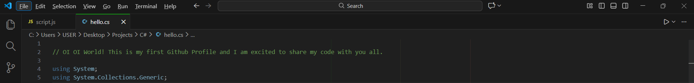

# Hello there 👋

### OMAR RASHED ALMANIFI
### *Computer Science Graduate | IT Support & Infrastructure | Troubleshooting • Networking • Server Deployment | Cross-Cultural Communicator*

I am a Computer Science graduate from Universiti Sains Malaysia (USM), specializing in Computing Infrastructure.
with hands-on experience in web development and cloud-native technologies, with a strong problem-solving mindset and attention to detail. Passionate about building efficient, scalable solutions and contributing to impactful tech projects.

# Skills 
## Languages:  

## Frameworks & Libraries: 

## Tools & Technologies: 

## Systems & Infrastructure: 
`Linux basics, server installation, network configuration (routers, switches).`

[Email]:(omarrashedalmanifi@gmail.com)  
